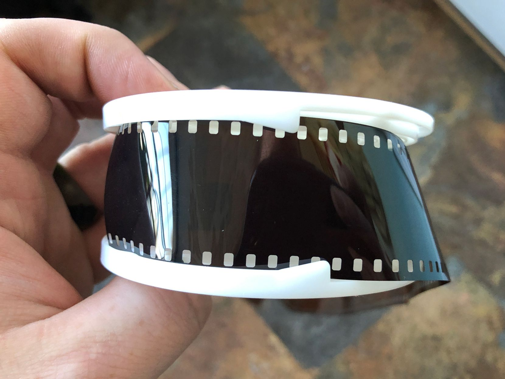
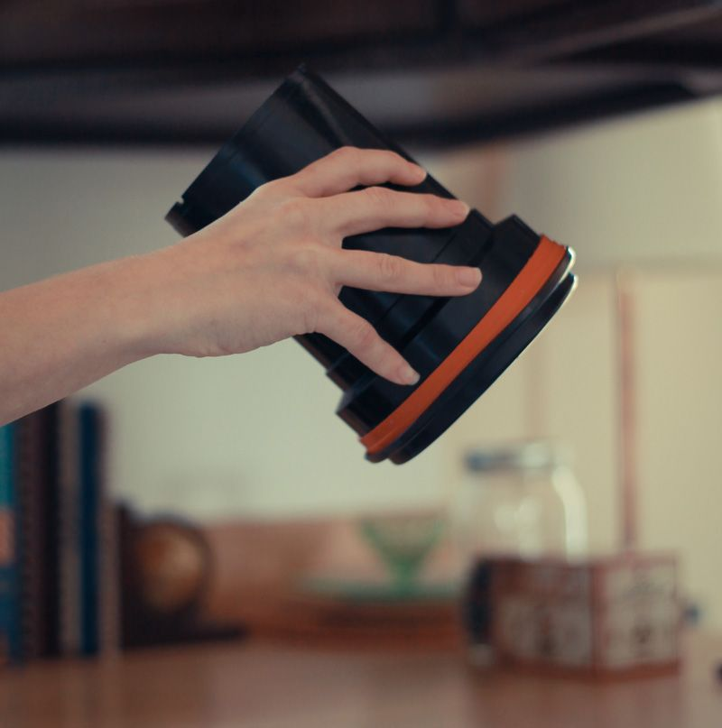
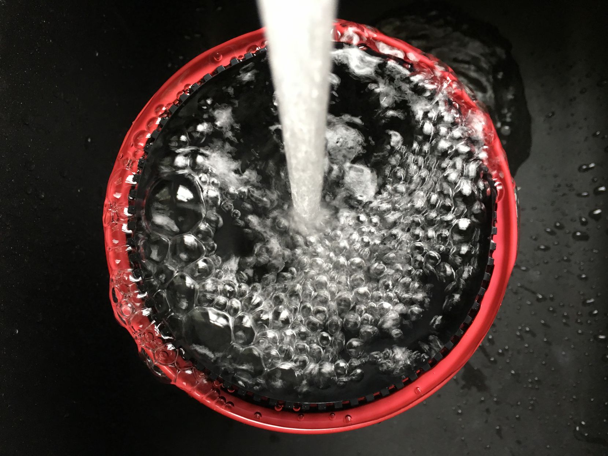

# Developing B&W film rolls

## What you will need: 

* Developer 
* Stop Bath 
* Fixer 
* Wetting Agent
* Developing Tank 
* Thermometer 
* Film Opener 
* Scissors

## **1. Get Ready**

Let’s start with loading the film. This needs to be done in complete darkness. If you have a dark room that’s perfect, to make things easy in the dark, lay your developing tank out in front of you with the lid off and the reel removed. You will also need a film canister opener \(for 35mm\), some scissors and your film. When you are ready, turn off the lights.


If it's your first time developing film we recommend this video to show you all the steps involved: [https://www.youtube.com/watch?v=aPQ7OPy8T2w](https://www.youtube.com/watch?v=aPQ7OPy8T2w)


## **2. Practice**

We would definitely recommend getting some exposed film to try the next step out in the light, we have some in the lab. You’ll get the hang of it and be loading the reels without thinking soon, but it can be tricky the first time. Practice makes perfect they say.

## **3. Load Your Film**

Now open your undeveloped film. Use an opener on 35mm to remove the top ring of the film canister and pull out the roll of film. Carefully cut the tongue of the film, leaving you with a straight edge that goes all the way across. If it is 120, then just unravel the roll and detach from the backing paper.

Now pick up the reel and make sure you can feel both notches on the outer edge are aligned. You then need to slide the end of the film under the two notches until you feel it catch the sprocket holes. If the film has gone in straight you will be able to turn both sides of the reel in an alternate back and forth motion, which will move the film along as you go.

Once the film is on the reel you need to put it in the tank. After the reel is in, put the lid on and turn it until it locks in place. Your developing tank is now light-tight and it’s safe to turn the lights on or take the tank out of the changing bag.

## **4. Pour Up Your Chemistry**

We use Kodak D76 as our primary developer for black adn white film. You'll find it already mixed under the sind. Dilution it with one part delveloper plus one part  water. You will need 300ml of developer, stop and fix per roll of 35mm film, and 500ml per 120 film.

Each chemical will also give you the time it takes to work and the temperature it works best at. When processing black and white film the standard temperature is 20°. It’s best to get your water to the right temperature first, then add in the chemistry. If you find it is warmer or cooler than it should be once mixed up just sit your jug in warm water to heat it up or cold water to cool it down.

If you’ve got three jugs you can mix up your developer, stop bath and fixer in advance so they are all ready to go as you need them.

## **5. Develop Black And White Film**

You’re now ready to process black and white film. Every film and developer combination has a specific developing time so make sure you know how long your combination will need. Set a timer going, a clock or your phone works fine for this, and slowly pour the developer into the central funnel of the processing tank. Once it is all in, securely fit the flat lid.

Throughout development, you will need to agitate the tank. This makes sure the film gets evenly developed. Agitate by turning the tank upside down, then back up again. Do this for the duration of the first minute. Once the minute is up bang the bottom of the tank against a hard surface. This will dislodge any air bubbles that have built up on the film. Continue agitating for the first 10-15 seconds of each minute until the full development time has passed.

This is the standard agitation, but some developers may have instructions for other methods. After some experimenting, you can find the one that works best for the results you’re after.

As the development time nears the end get ready to pour out your developer. A one-shot developer, such as Foma R09 should be discarded. A reusable developer can be put into an airtight plastic bottle to be used again.

## **6. Stop Bath**

Now quickly pour in the diluted stop bath. This will completely stop development. Agitate the stop for a minute and pour back into a storage bottle. The stop can be reused many times so don’t waste it.

## **7. Fix Your Film**

Next, pour in your fix and again agitate for the first minute. Fixing will take up to 3-5 minutes. The fix can also be used again so pour it out into a bottle once the film is fully fixed. About halfway through fixing the film will be safe to look at in the light if you can’t wait to see it. Make sure you give it the full time though as this is key to the longevity of your negatives.

## **8. Wash And Hang Up To Dry**

Now the film is developed and fixed you just need to wash it. Leave the tank under running water for 10-20 minutes. 

Alternatively, fill the tank and agitate, inverting the tank 5 times. Empty and refill the tank, this time invert 10 times. Next, empty and refill, then invert 20 times. Finally, empty the tank.

When the film has been through the wash, fill the tank with water and put a couple of drops of wetting agent in. Leave to soak for a minute then hang up to dry in the drying cabienet.

You can use your fingers, chamois leather or squeegees to wipe the excess water from the film before hanging up to dry. Use a clip at the top and one at the bottom to help prevent curly film once it’s dry.

That is all there is to it. You should now be able to see your fully developed film.

## 9. Cleaning up


For the shared darkroom to work - everyone has to take responsibility for cleaning and making sure everything is where it should be!


Pour chemicals back into their bottles. Take all the equipment that you have used and clean it thourougly with dish soap. Put everything on the drying rack. Make sure that everything is where it should be when you leave.

## 10. \(optional\) - Scan or take photos of your negatives 

Knepp offers great scanners for all your 135 and 120 film. If you don't have time to scan right now - use the light tables and your phone to photograph your negatives! Now it's time to enjoy your work! **Well done!**

