# JOBO CPA 2 – Color Film Processing Guide

This guide explains how to use the **JOBO CPA 2 processor** with the **JOBO tank system** for developing color films (C-41 or similar).

---

## System Overview

### 1. JOBO CPA 2 Processor
Used to control temperature, agitation, and timing.  
Includes a water bath, lift head, and control panel with temperature and motor speed knobs.

<figure>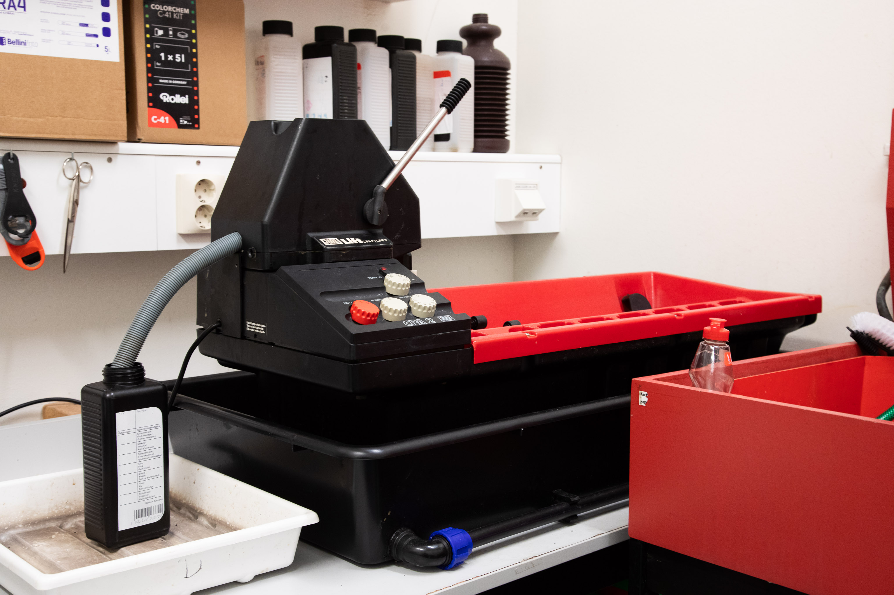<figcaption><p>Jobo CPA2 Processor</p></figcaption></figure>

### 2. JOBO Tank System
- **1500 series**: for 135 and 120 rolls  
- **2800 series**: for large format film and paper prints

<figure>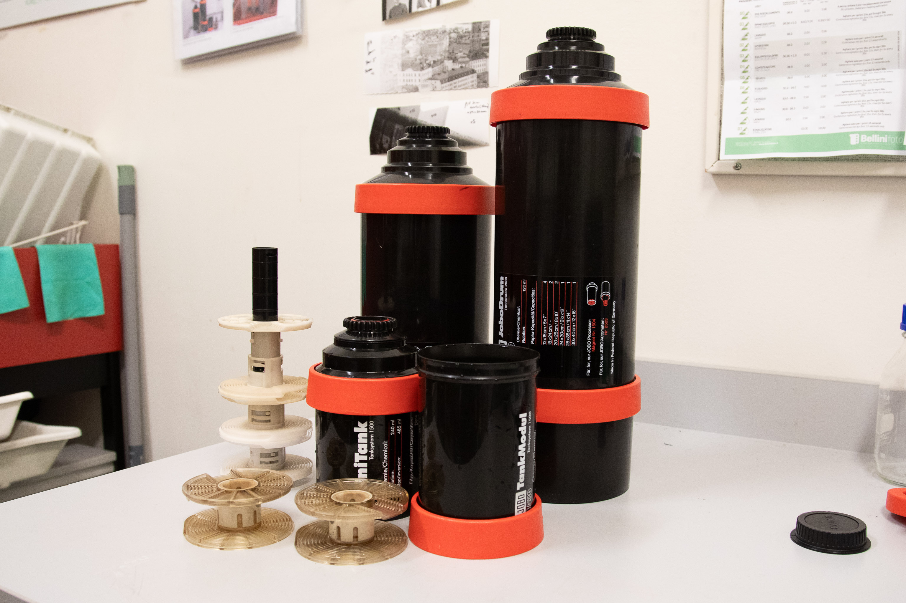<figcaption><p>Jobo film developing tanks and paper drums</p></figcaption></figure>

---

## Step 1 – Preparation

<figure>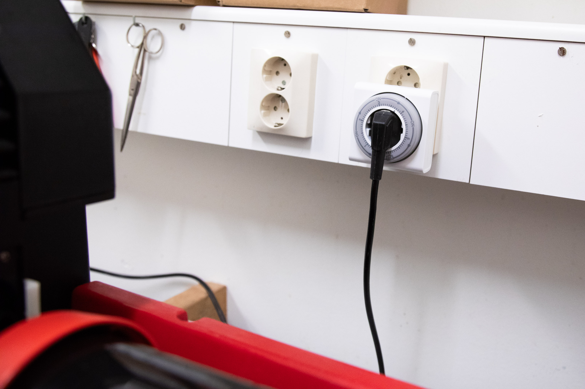</figure>

- Before turning on the machine, set timer. Max time is 5 hours.
- Choose your tank:
  - **1520 tank** → up to **two 135 or 120 rolls**
  - **1520 + 1530 tanks combined** → up to **five 135 or six 120 rolls**
- Prepare chemicals:
  ```text
  1520 tank:         240–300 ml
  1520 + 1530 tank:  570–600 ml
  ```
- Pour chemicals into labeled bottles and matching measuring cylinders.
- Check the C41 Dev Log to see how fresh are the chemicals
- Fill the Jobo with water until the level reaches **the center of the roller holder**.

<figure>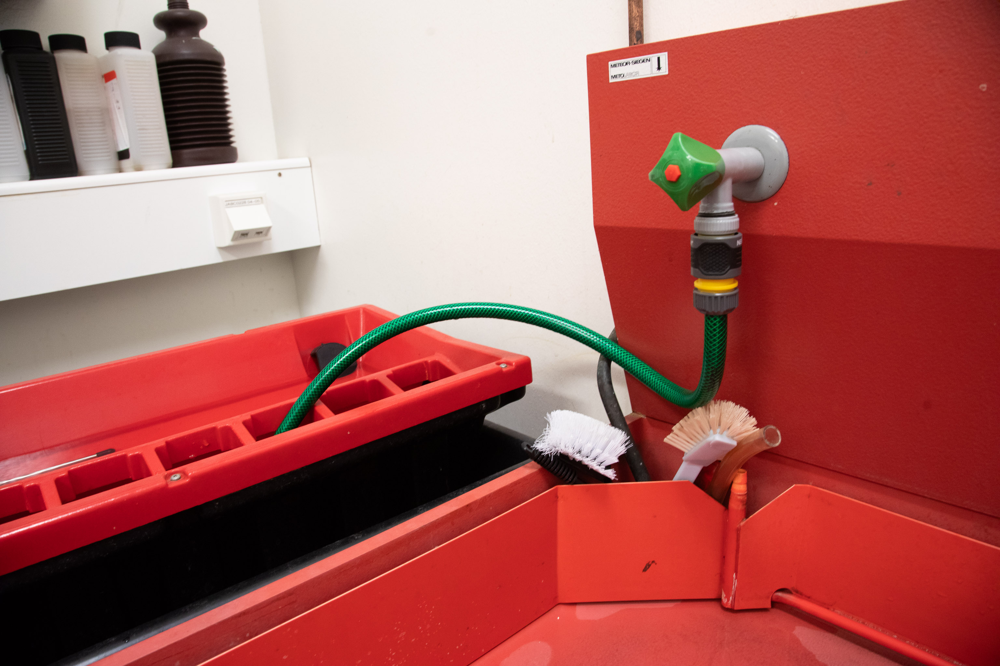</figure>


It’s helpful pour in already hot water, so the heating process gets quicker. To do it, set 40° on the water tap.


---

## Step 2 – Pre-warming Setup

<figure>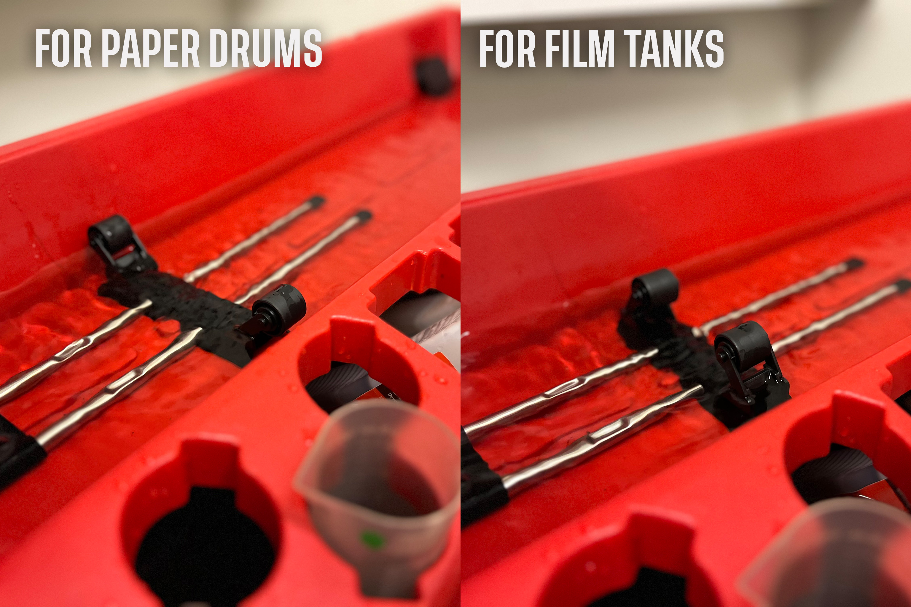</figure>

1. Place bottles and measuring cylinders in the water bath for pre-warming.  
   Lock them in place to prevent floating.
2. Adjust the **roller holder**:
   - Inward = for 1500 tanks  
   - Outward = for 2800 tanks
3. Attach the tank to the processor.

<figure>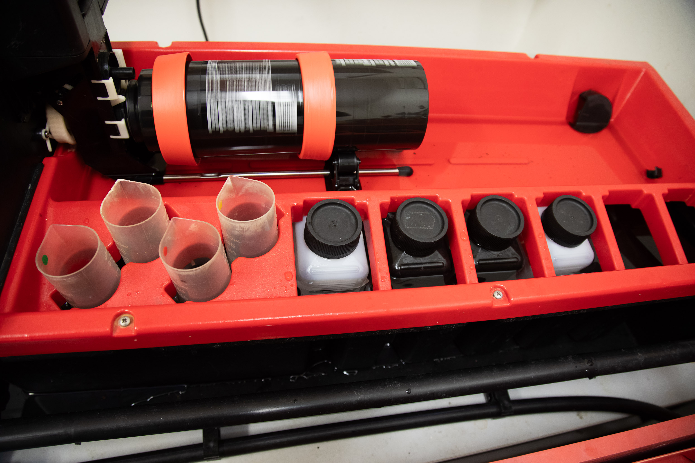</figure>

---

## Step 3 – Temperature Setup

<figure>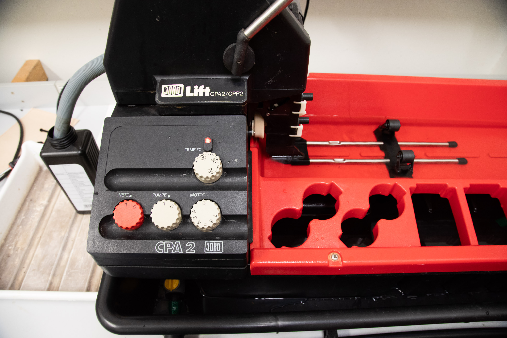</figure>

1. Turn on:
   - `NETZ 1` – Main power  
   - `PUMPE 1` – Circulation pump
2. Set the **temperature knob** to **40 °C** (≈ 38 °C actual in the bath).
3. When the water bath reaches **38 °C**, wait an additional **10 minutes** to stabilize.


It’s always good to have a theromometer around to check the actual temperature. 


---

## Step 4 – Processing

<figure>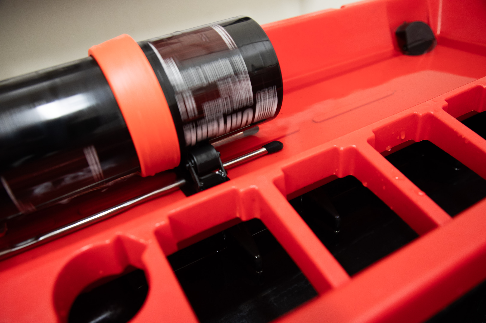</figure>

1. Turn on the **motor** (`MOTOR 1`) and set speed to **F** or **3** — suitable for color processing.  
2. Add chemicals through the **lift head opening**, in order:
   1. Developer  
   2. Blix (Bleach + Fix)  
   3. Stabilizer
3. Keep a container ready to **collect used chemicals** from the output hose.
4. Follow the recommended C-41 times:
<figure>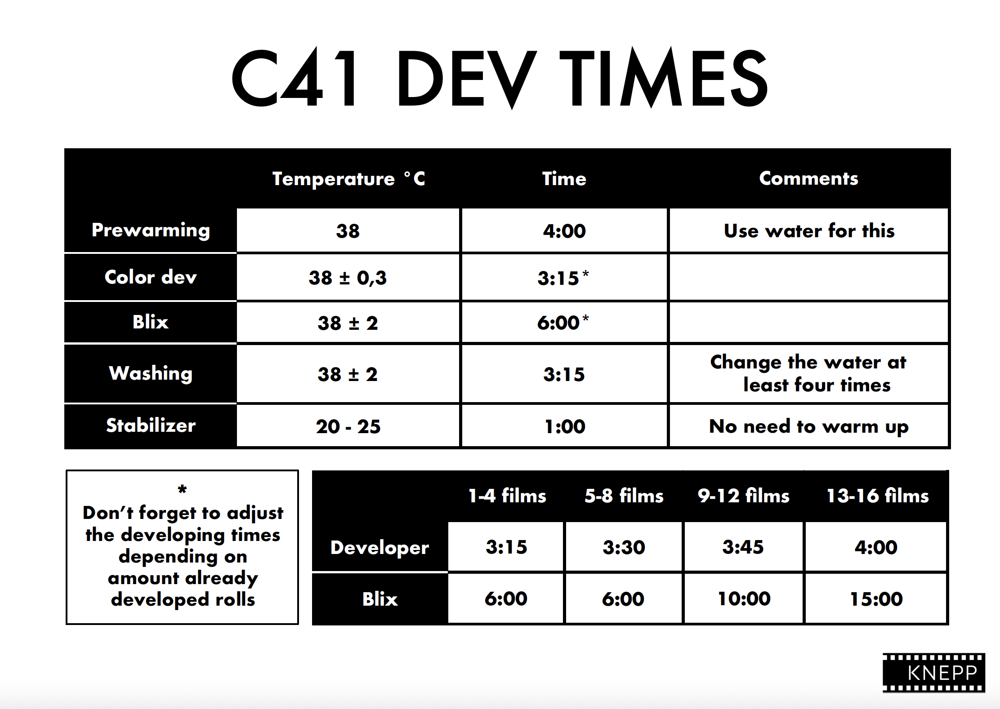</figure>
5. After each step:
   - Lift the tank using the lift.  
   - Drain the chemical through the lift head pipe  
   - Pour in the next solution

<figure>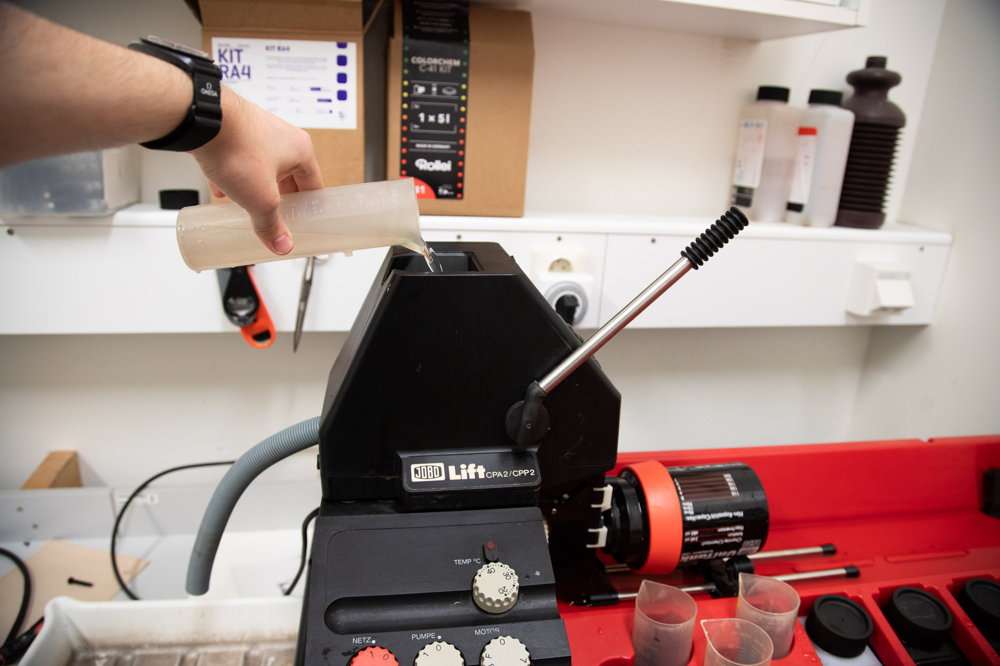</figure>
<figure>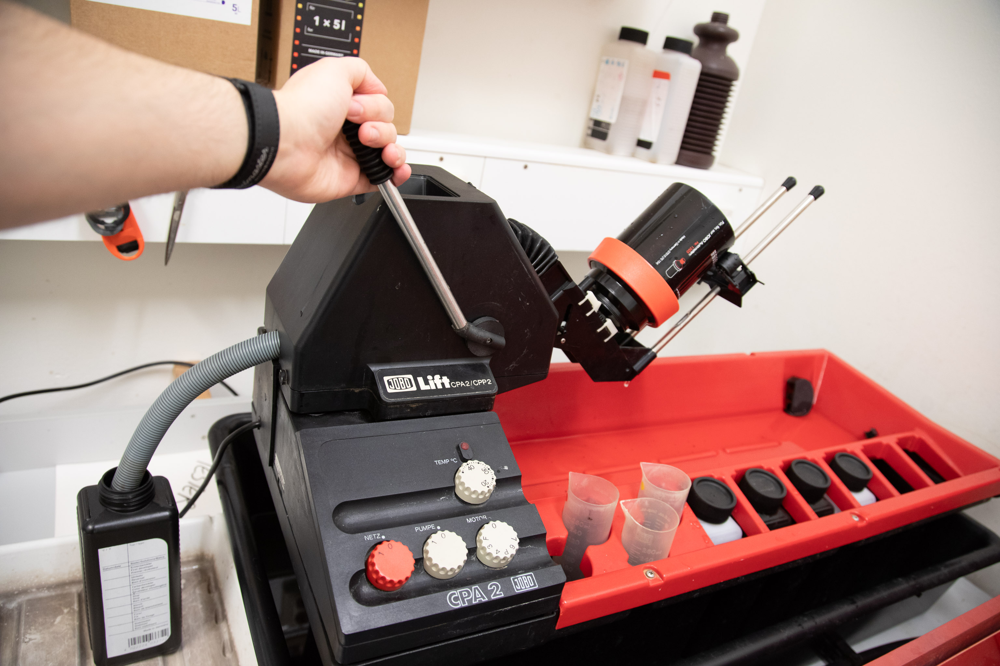</figure>

---

## Step 5 – Finishing Up

1. After the final rinse, **turn off the processor**.  
2. Lift the tank and drain remaining liquids.  
3. Carefully remove the tank from the processor.  
4. Turn off the **pump** and **processor**.  
5. Empty the water bath by opening the drain under the processor.

<figure>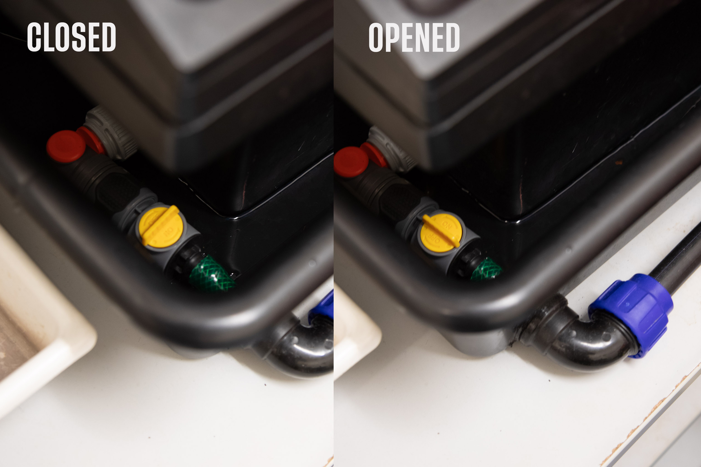</figure>

---

## Step 6 – Cleanup

<figure>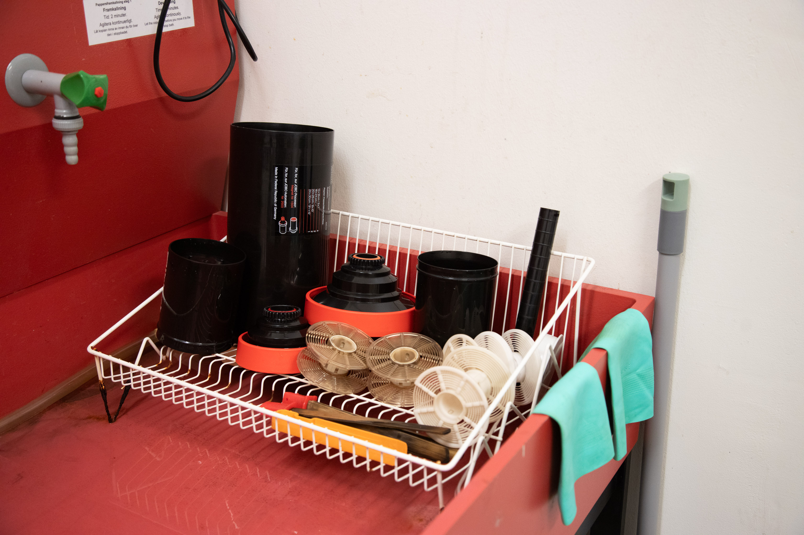</figure>

1. Wash and dry:
   - Tanks  
   - Reels  
   - Measuring cylinders  
   - Containers
2. Return all equipment to its proper place.  
3. Reset the **timer**.
   

Don't forget to update the C41 dev chart, so we know when to prepare a new batch of fresh chemicals! 


---

## Notes

- Always wear gloves when handling chemicals.  
- <del> Ensure proper ventilation in the workspace. </del>
- Check the C-41 developer usage chart before starting — replace chemistry as needed.  
- Keep the work area dry and clean after use.

---
