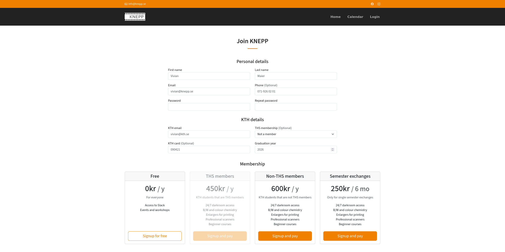
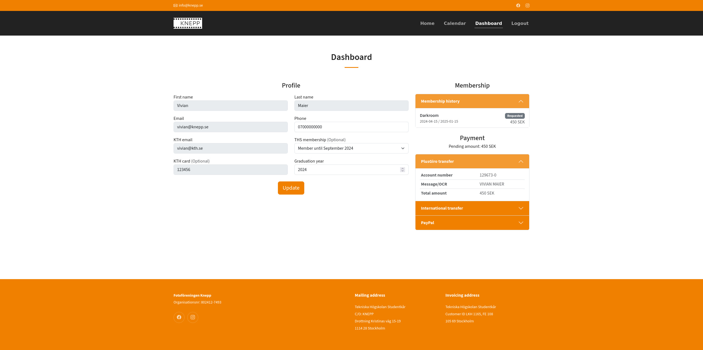

# Become a new member

Head over to the [signup page](https://knepp.se/user/signup) and enter your details, a KTH email is required as we are only open to KTH students. Select the right type of membership and click on "signup". If you are a THS member you can select until when your current THS membership is valid for, KTH cards are also mandatory for paid darkroom memberships.

There are different type of memberships ranging from free to paid.

* Free: Provides access to Slack and some events that are non-darkroom related.
* THS members: Yearly darkroom membership with full access to the lab for KTH students that are paying members of THS.
* Non-THS members: Yearly darkroom membership with full access to the lab for KTH students or employees that are not members of THS.
* Semester exchanges: One semester membership with full access to the lab available only for those studying for a single semester at KTH.

There are also only two expiry dates for memberships given the restrictions imposed by the card office at KTH. This means that memberships are not computed according to the rolling year given by when the membership was created but instead they can only expire January 15th or June 15th according to which one is within range of the membership with a grace period of one month. For example, for members that joined in September for a full year, their membership will last until June the following year. This only affects members when they join for the first time as the renewal will be made next June for another full year until the June of the next year.

<figure><figcaption>
Signup page
</figcaption></figure>

After signing up you will have to confirm your email address in order to be able to proceed. Once you are logged in, you will be able to proceed with the payment for your membership. On the user dashboard you can see your profile details as well as your membership history.

If you haven't paid for your current membership a set of payment methods are included (PlusGiro, IBAN transfer or PayPal). If your current membership is expired you will also be able to renew it from this portal. When you have made the payment you can check this page for status such as when it is being processed and when access has been granted.

<figure><figcaption>
User dashboard page
</figcaption></figure>
