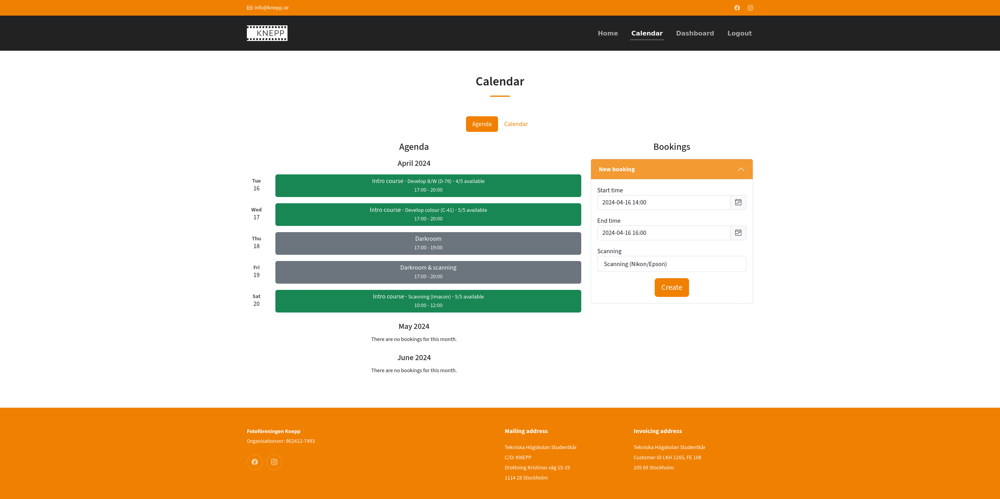
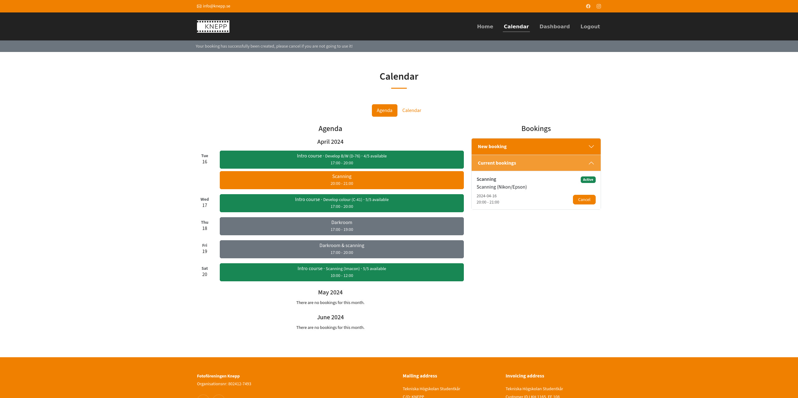

# Create and view bookings

Head over to the [calendar page](https://knepp.se/booking/calendar) to see the current darkroom bookings and introduction courses. If you are on a desktop computer, a calendar view is also available for the entire month. You can see both other member's bookings and your own but you can only create or cancel your own. To create a new booking simply enter the right times and the activity you want to book on the "new booking" form.

Note that not all activities are available to all members and it depends on introduction courses, if you have not attended the Imacon scanning tutorial for example you won't be able to book the lab for that purpose. If you think you should be able to book an activity without a course please drop us a message on Slack and we'll fix it for you!

<figure><figcaption>
Agenda page
</figcaption></figure>

You can also cancel a booking by clicking on "cancel" in any of the bookings you have. Your bookings will be shown in orange while other member's bookings are shown in grey. Please make sure to cancel if you know you will not be able to make it so that the darkroom can be available for other members.

If you have an account on Slack with the same email on the system you can do all this via the workspace directly, you will also even receive status messages.

<figure><figcaption>
Agenda page with an active booking
</figcaption></figure>
