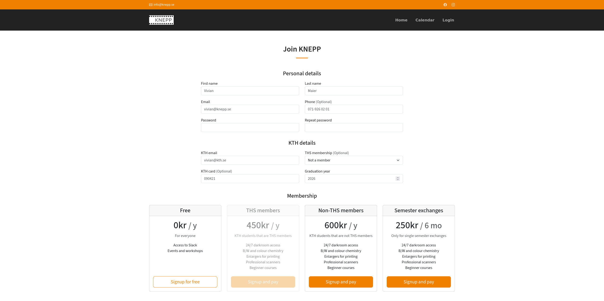
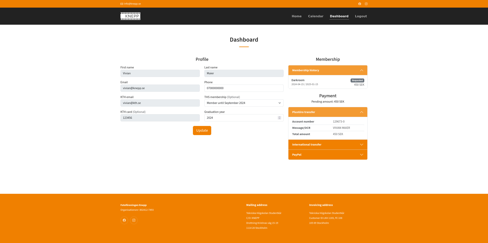

# How to join

Head over to the [signup page](https://knepp.se/user/signup) and enter your details, a KTH email is required as we are only open to KTH students. Select the right type of membership and click on "signup". If you are a THS member you can select until when your current THS membership is valid for, KTH cards are also mandatory for paid darkroom memberships.

<figure><figcaption>
Signup page
</figcaption></figure>

After signing up you will have to confirm your email address in order to be able to proceed. Once you are logged in, you will be able to proceed with the payment for your membership. On the user dashboard you can see your profile details as well as your membership history.

If you haven't paid for your current membership a set of payment methods are included (PlusGiro, IBAN transfer or PayPal). If your current membership is expired you will also be able to renew it from this portal. When you have made the payment you can check this page for status such as when it is being processed and when access has been granted.

<figure><figcaption>
User dashboard page
</figcaption></figure>
