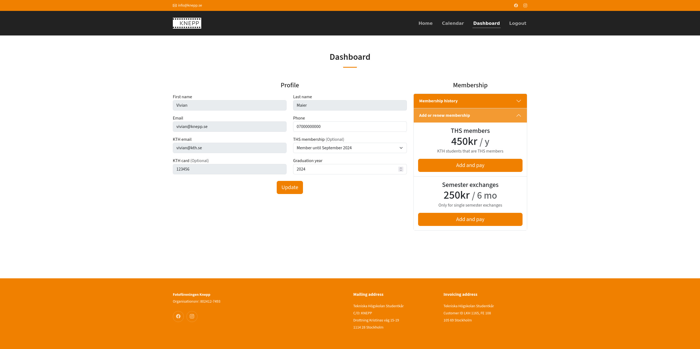

# Renew membership

If your current membership expires in 30 days or less you are able to renew it via the [user dashboard](https://knepp.se/user/dashboard) so that you don't loose access to the darkroom. The process is quite similar to when [becoming a new member](become-a-new-member.md) and the payment options are identical. Please make sure to select the right THS membership before confirming any new subscription so that you pay the right amount.

There are also only two expiry dates for memberships given the restrictions imposed by the card office at KTH. This means that memberships are not computed according to the rolling year given by when the membership was created but instead they can only expire January 15th or June 15th according to which one is within range of the membership with a grace period of one month.

<figure><figcaption>
Dashboard user view with membership renewal
</figcaption></figure>
