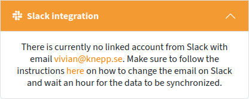
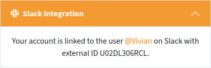
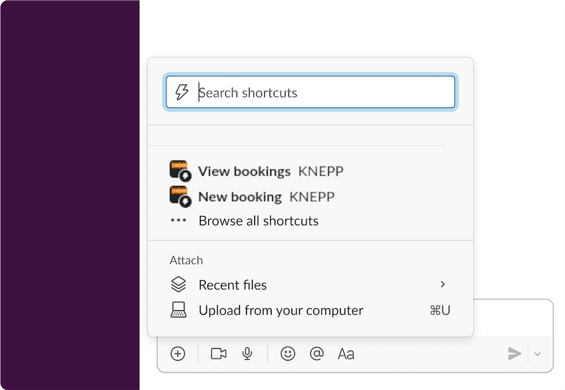

# Slack integration

Before proceeding, you must make sure that your account is properly synced and linked with the management system. You can check the current status on the [user dashboard](https://knepp.se/user/dashboard) under "Slack integration". This box will let you know what to do if your account is currently unlinked.



<figure><figcaption>
Slack integration information box for an unlinked account
</figcaption></figure>



<figure><figcaption>
Slack integration information box for a linked account
</figcaption></figure>



You can create a new booking and see your next 10 upcoming bookings directly on Slack. To do so you will need a linked account and an active darkroom membership. To do either action simply navigate to the search bar and type "booking" for example to list all available shortcuts containing that text. You can even click on the shortcut button during a conversation and select the right action you want to perform.

<figure><figcaption>
Shortcut list on Slack
</figcaption></figure>

#### New booking

You can create a booking similarly to how you do it via the [calendar page](https://knepp.se/booking/calendar) in the website. Simply enter the start and end time and select the right activity. You will only be able to book those available to you after completing the right introduction courses.

If you are using Slack on your desktop computer, proper error messages might be displayed for example when the times are not correct, you have not selected any activities or your booking overlaps with another one already existing. However, if you use your phone, a generic error message will be displayed.

#### View bookings

You can list your upcoming bookings to see if you have reserved any rooms. It is also possible to cancel any of them by simply clicking on "unbook".
