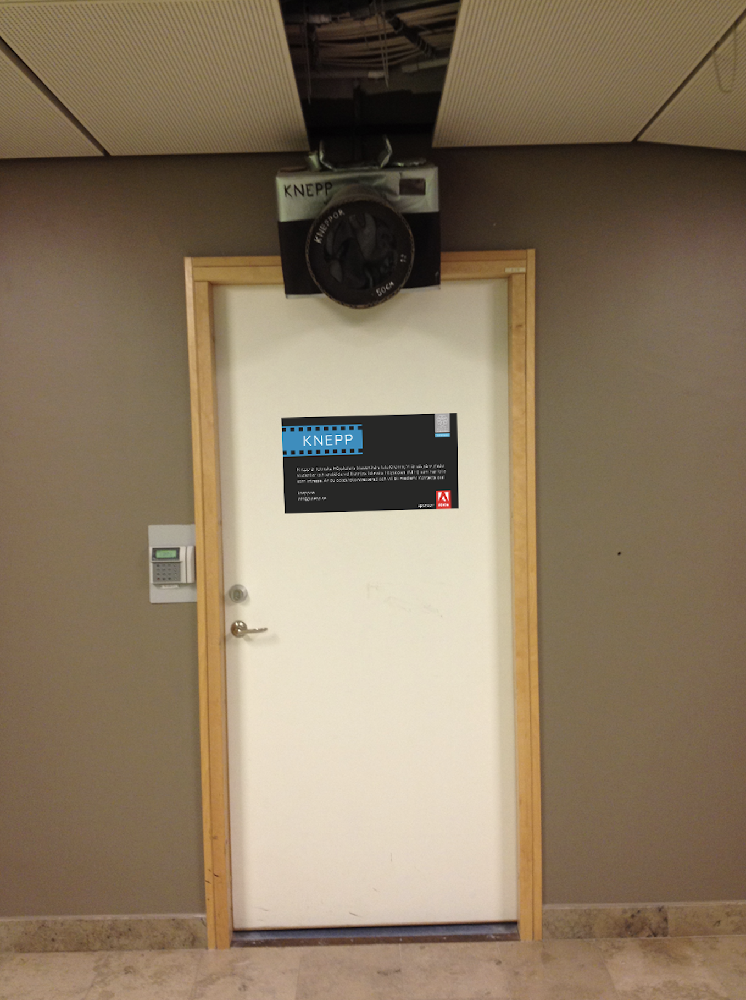

# Access to the darkroom

## Where is it?

We're located on floor 2 in the [Q building at KTH Main Campus](https://www.google.com/maps/place/Malvinas+V%C3%A4g+4,+114+28+Stockholm/@59.3501665,18.0647645,17z/data=!3m1!4b1!4m5!3m4!1s0x465f9d6b2e04a231:0x50419256350f01a1!8m2!3d59.3501665!4d18.0669532). Just enter the Q building, go down the stairs and on your left you should see a door with our logo and a big camera hanging at the entrance.

## Membership

For a yearly access to our lab we ask for 450kr. We guarantee...

* Access to two enlargers, paterson tanks, film dryier, filters and more.
* Digital lab with...
  * Imacon.
  * Coolscan IV.
  * Flatbed scanner.
* Fresh supply of chemistry (developers, fix, stop) for both B\&W and C41 development.
* Some papers and chemistry for making prints.

## How to get access?

After you become a member you will be able to book a time and use our darkroom whenever it will suit you.

1. Become a member through [our website](https://knepp.se/user/signup).
2. Send us a message on [Facebook](https://www.facebook.com/KneppKTH/) or mail ([info@knepp.se](mailto:info@knepp.se)) and pay via PlusGiro or PayPal.
3. We will set up a intro course on how to use our equipment.
4. We will ask you about the number on your KTH access card so that you could visit the darkroom anytime on your own.
